# IPv6 Addressing with Cisco Packet Tracer

## Lab Overview

This lab demonstrates the configuration and verification of an IPv6
network using Cisco Packet Tracer.

The topology contains:

-   1 router: R1
-   1 ISP router
-   2 LAN segments
-   2 switches
-   4 client PCs
-   2 servers
-   IPv6 global unicast and link-local addressing
-   IPv6 routing between LANs
-   End-to-end connectivity testing

### Objective

Configure IPv6 addressing on the router, servers, and clients, then
verify communication between the LANs and the ISP.

------------------------------------------------------------------------

## Network Topology

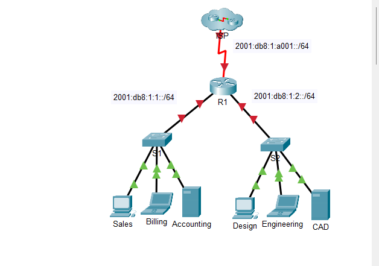

### IPv6 Networks

  Network                  Purpose
  ------------------------ --------------------------------
  `2001:db8:1:1::/64`      Sales, Billing, Accounting LAN
  `2001:db8:1:2::/64`      Design, Engineering, CAD LAN
  `2001:db8:1:a001::/64`   R1-to-ISP serial link

------------------------------------------------------------------------

## Addressing Plan

  Device        Interface   IPv6 Address           Prefix       Default Gateway
  ------------- ----------- ---------------------- ------------ -----------------
  R1            G0/0        `2001:db8:1:1::1`      `/64`        N/A
  R1            G0/0        `fe80::1`              Link-local   N/A
  R1            G0/1        `2001:db8:1:2::1`      `/64`        N/A
  R1            G0/1        `fe80::1`              Link-local   N/A
  R1            S0/0/0      `2001:db8:1:a001::2`   `/64`        N/A
  R1            S0/0/0      `fe80::1`              Link-local   N/A
  ISP           S0/0/0      `2001:db8:1:a001::1`   `/64`        N/A
  Sales         NIC         `2001:db8:1:1::2`      `/64`        `fe80::1`
  Billing       NIC         `2001:db8:1:1::3`      `/64`        `fe80::1`
  Accounting    NIC         `2001:db8:1:1::4`      `/64`        `fe80::1`
  Design        NIC         `2001:db8:1:2::2`      `/64`        `fe80::1`
  Engineering   NIC         `2001:db8:1:2::3`      `/64`        `fe80::1`
  CAD           NIC         `2001:db8:1:2::4`      `/64`        `fe80::1`

------------------------------------------------------------------------

# Step-by-Step Configuration

## 1. Enable IPv6 routing on R1

Open:

**R1 → CLI**

Enter privileged EXEC mode and global configuration mode:

``` text
R1> enable
R1# configure terminal
```

Enable IPv6 packet forwarding:

``` text
R1(config)# ipv6 unicast-routing
```

This allows R1 to route IPv6 traffic between different IPv6 networks.

------------------------------------------------------------------------

## 2. Configure R1 GigabitEthernet0/0

G0/0 is the gateway for the `2001:db8:1:1::/64` LAN.

``` text
R1(config)# interface gigabitEthernet 0/0
R1(config-if)# ipv6 address 2001:db8:1:1::1/64
R1(config-if)# ipv6 address fe80::1 link-local
R1(config-if)# no shutdown
R1(config-if)# exit
```

### Screenshot

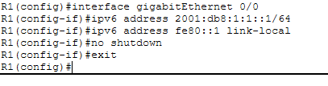

------------------------------------------------------------------------

## 3. Configure R1 GigabitEthernet0/1

G0/1 is the gateway for the `2001:db8:1:2::/64` LAN.

``` text
R1(config)# interface gigabitEthernet 0/1
R1(config-if)# ipv6 address 2001:db8:1:2::1/64
R1(config-if)# ipv6 address fe80::1 link-local
R1(config-if)# no shutdown
R1(config-if)# exit
```

### Screenshot

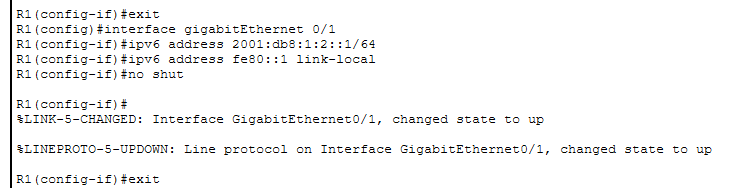

The interface reported `changed state to up` and the line protocol also
came up, confirming that the interface became operational.

------------------------------------------------------------------------

## 4. Configure R1 Serial0/0/0

The serial interface connects R1 to the ISP.

``` text
R1(config)# interface serial 0/0/0
R1(config-if)# ipv6 address 2001:db8:1:a001::2/64
R1(config-if)# ipv6 address fe80::1 link-local
R1(config-if)# no shutdown
R1(config-if)# exit
```

### Screenshot

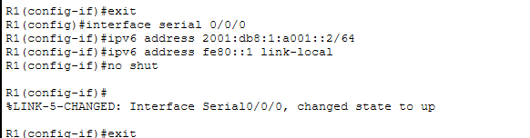

The Packet Tracer output shows the serial interface changing to an
operational state.

------------------------------------------------------------------------

## 5. Configure the Accounting Server

Open:

**Accounting → Desktop → IP Configuration**

Select **Static** under IPv6 Configuration and enter:

``` text
IPv6 Address: 2001:db8:1:1::4
Prefix Length: 64
Default Gateway: fe80::1
```

### Screenshot

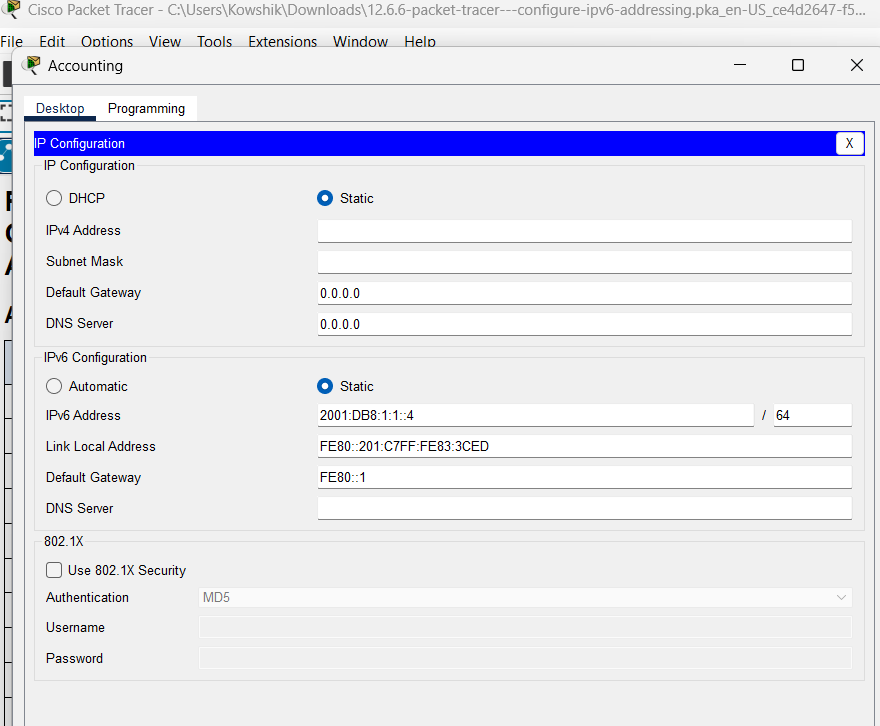

------------------------------------------------------------------------

## 6. Configure the CAD Server

Open:

**CAD → Desktop → IP Configuration**

Enter:

``` text
IPv6 Address: 2001:db8:1:2::4
Prefix Length: 64
Default Gateway: fe80::1
```

### Screenshot

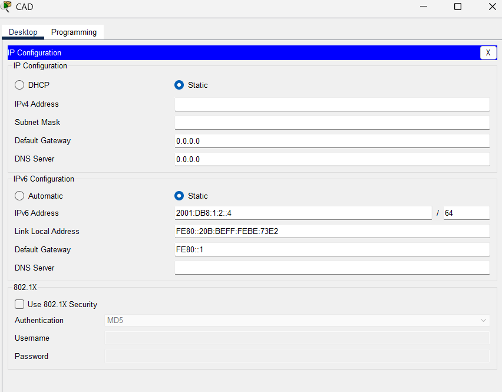

------------------------------------------------------------------------

## 7. Configure the Engineering PC

Open:

**Engineering → Desktop → IP Configuration**

Enter:

``` text
IPv6 Address: 2001:db8:1:2::3
Prefix Length: 64
Default Gateway: fe80::1
```

### Screenshot

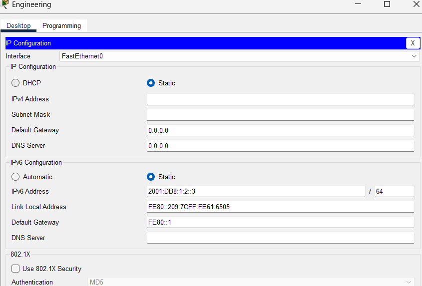

------------------------------------------------------------------------

## 8. Configure the Design PC

Open:

**Design → Desktop → IP Configuration**

Enter:

``` text
IPv6 Address: 2001:db8:1:2::2
Prefix Length: 64
Default Gateway: fe80::1
```

### Screenshot

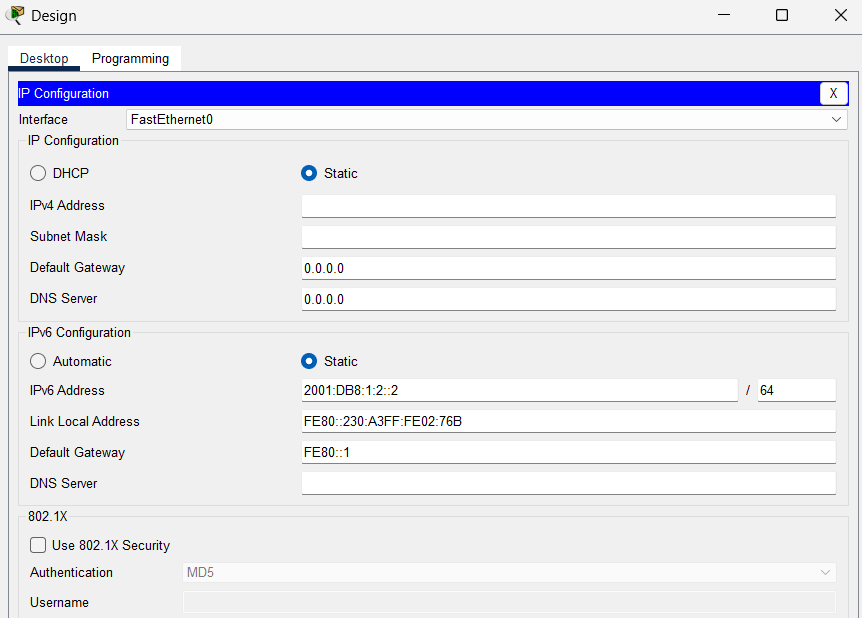

------------------------------------------------------------------------

## 9. Configure the Billing PC

Open:

**Billing → Desktop → IP Configuration**

Enter:

``` text
IPv6 Address: 2001:db8:1:1::3
Prefix Length: 64
Default Gateway: fe80::1
```

### Screenshot

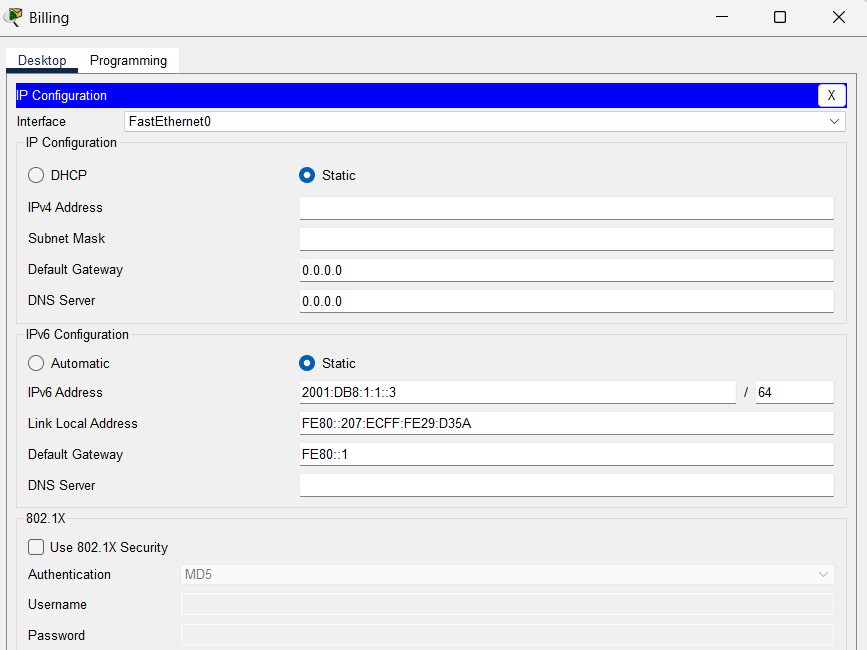

------------------------------------------------------------------------

## 10. Configure the Sales PC

Open:

**Sales → Desktop → IP Configuration**

Enter:

``` text
IPv6 Address: 2001:db8:1:1::2
Prefix Length: 64
Default Gateway: fe80::1
```

### Screenshot

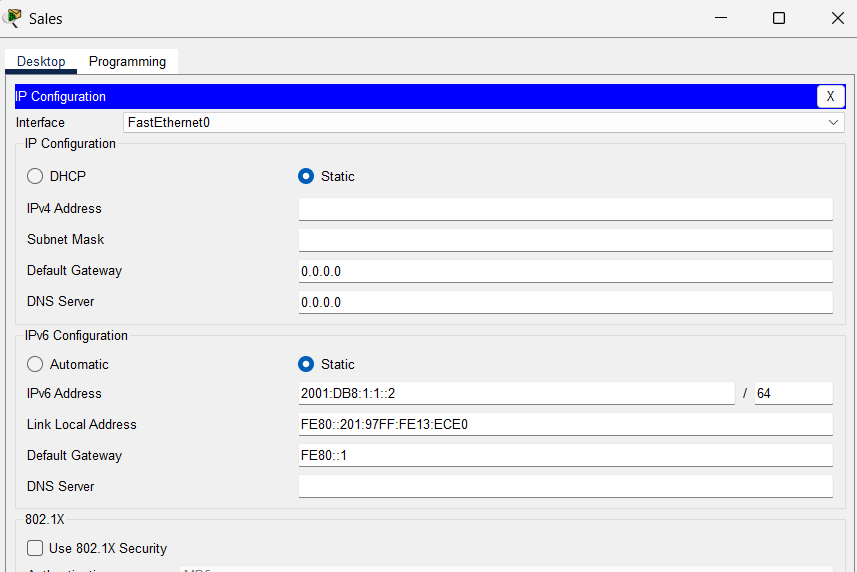

------------------------------------------------------------------------

# Verification and Testing

## 11. Verify the router configuration

From R1:

``` text
R1# show ipv6 interface brief
```

Verify that the following addresses are configured:

``` text
GigabitEthernet0/0
2001:db8:1:1::1
fe80::1

GigabitEthernet0/1
2001:db8:1:2::1
fe80::1

Serial0/0/0
2001:db8:1:a001::2
fe80::1
```

Also verify that the interfaces are operational.

------------------------------------------------------------------------

## 12. Test local LAN connectivity

From a client Command Prompt:

``` text
ping 2001:db8:1:1::1
```

This tests communication with the R1 gateway on the left LAN.

For the right LAN:

``` text
ping 2001:db8:1:2::1
```

------------------------------------------------------------------------

## 13. Test inter-LAN connectivity

From Sales:

``` text
ping 2001:db8:1:2::4
```

This tests:

**Sales → R1 → Right LAN → CAD**

A successful reply demonstrates IPv6 routing between the two LANs.

------------------------------------------------------------------------

## 14. Test ISP connectivity

From any client:

``` text
ping 2001:db8:1:a001::1
```

This verifies the IPv6 path from the client through R1 to the ISP.

------------------------------------------------------------------------

## 15. Verify application-level connectivity

From the Sales PC, open:

**Desktop → Web Browser**

Enter the CAD server IPv6 address:

``` text
http://[2001:db8:1:2::4]
```

The successful result displays:

**CAD Server**

### Screenshot

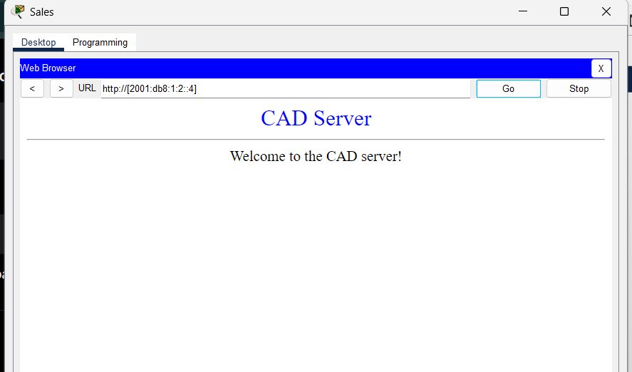

This provides application-layer evidence that the IPv6 configuration and
routing are working.

------------------------------------------------------------------------

# Key Concepts Demonstrated

### IPv6 Global Unicast Addressing

The lab uses documentation IPv6 addresses from:

``` text
2001:db8::/32
```

Each LAN receives its own `/64` prefix.

### IPv6 Link-Local Addressing

The router uses:

``` text
fe80::1
```

as the link-local gateway address.

IPv6 hosts use the router's link-local address as their default gateway.

### IPv6 Routing

The command:

``` text
ipv6 unicast-routing
```

enables IPv6 forwarding on R1.

R1 then routes traffic between:

``` text
2001:db8:1:1::/64
```

and

``` text
2001:db8:1:2::/64
```

### End-to-End Verification

Connectivity is verified using:

-   `show ipv6 interface brief`
-   IPv6 `ping`
-   Web browser access using an IPv6 address

------------------------------------------------------------------------

# Skills Demonstrated

-   Cisco IOS CLI configuration
-   IPv6 addressing
-   IPv6 `/64` subnetting
-   Global unicast addressing
-   Link-local addressing
-   IPv6 default gateways
-   IPv6 routing
-   Router interface configuration
-   Serial WAN configuration
-   Client/server network configuration
-   Network troubleshooting
-   Connectivity verification
-   Cisco Packet Tracer

------------------------------------------------------------------------

# Troubleshooting Notes

If an IPv6 ping fails, check the following:

1.  Confirm the IPv6 address is correct.
2.  Confirm the prefix length is `/64`.
3.  Confirm the host's default gateway is `fe80::1`.
4.  Confirm `ipv6 unicast-routing` is enabled on R1.
5.  Confirm the correct R1 interface has `no shutdown`.
6.  Run:

``` text
show ipv6 interface brief
```

7.  Verify that the interface is `up/up`.
8.  Test connectivity one hop at a time.

------------------------------------------------------------------------

# Lab Result

**Status: Completed**

The IPv6 addressing scheme was successfully implemented across the
router, servers, and clients. Inter-LAN routing was configured on R1,
and application-level connectivity to the CAD server was verified
successfully using IPv6.

------------------------------------------------------------------------

## Recommended GitHub Repository Structure

``` text
ipv6-addressing-packet-tracer/
│
├── README.md
│
├── screenshots/
│   ├── 00-topology.png
│   ├── 01-router-serial-config.png
│   ├── 02-router-g0-1-config.png
│   ├── 03-router-g0-0-config.png
│   ├── 04-accounting-ipv6.png
│   ├── 05-engineering-ipv6.png
│   ├── 06-design-ipv6.png
│   ├── 07-billing-ipv6.png
│   ├── 08-sales-ipv6.png
│   ├── 09-cad-ipv6.png
│   └── 10-cad-web-connectivity.png
│
└── packet-tracer/
    └── configure-ipv6-addressing.pka
```

## Suggested Repository Description

> Cisco Packet Tracer lab demonstrating IPv6 addressing, link-local
> gateways, router configuration, IPv6 routing, and end-to-end
> connectivity verification.

## Suggested GitHub Topics

``` text
cisco
packet-tracer
ipv6
networking
ccna
cisco-ios
network-engineering
routing
ipv6-addressing
```
